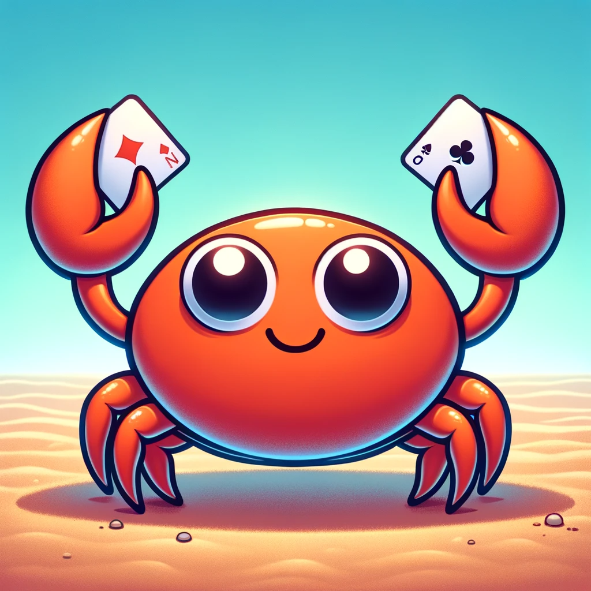

# Unlimited Poker

### WIP, a poker game server backend written in rust using the following dependencies:
- Actix web service framework
- async-graphql GraphQL server library
- push based architecture using web socket
- Coming soonest: k8s containerized deployment using in memory
- Coming soon: NoSql database (MongoDB or Redis)
- Coming soon: RL trained players
- Coming soon: kafka and/or flink for distributed streaming and horizontal scaling of stateless real-time eventing
- Coming soon: react front end

### Usage
- see instructions to play using graphiql graphql playground: [play](./play.md)
- 